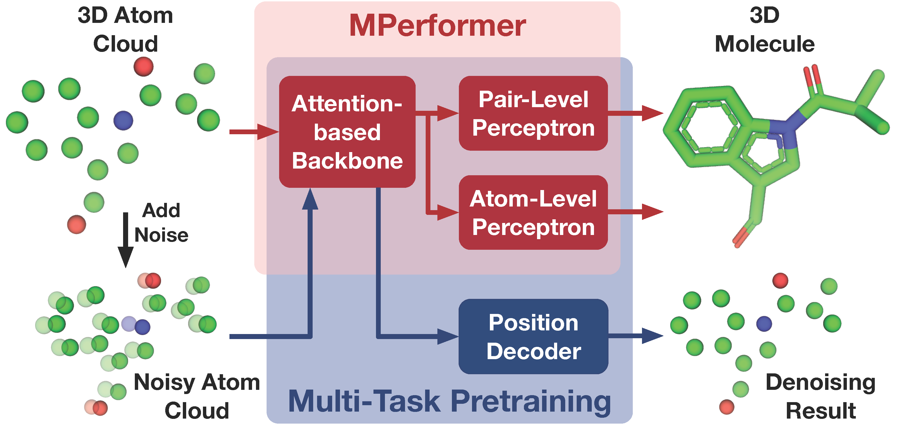

# MPerformer: An SE(3) Transformer-based Molecular Perceptron
[](https://github.com/FanmengWang/MPerformer/blob/master/LICENCE.txt)
[](https://pytorch.org/)

[[Paper]](https://dl.acm.org/doi/abs/10.1145/3583780.3614974) [[Slide]](https://github.com/FanmengWang/MPerformer/blob/master/Slide/MPerformer_CIKM23.pdf) [[Demo]](https://app.bohrium.dp.tech/mperforemr/) 

This is the official implementation of "MPerformer: An SE(3) Transformer-based Molecular Perceptron"

MPerformer is a universal learning-based molecular perception method to construct 3D molecules with complete chemical information purely based on molecular 3D atom clouds.
<p align="center"></p>
<p align="center"><b>An illustration of MPerformer and its learning paradigm.</b></p>


Dependencies
------------
 - [Uni-Core](https://github.com/dptech-corp/Uni-Core), you can check its [Installation Documentation](https://github.com/dptech-corp/Uni-Core#installation).
 - ```bash
   pip install rdkit-pypi==2021.9.4
   pip install dpdata
   ```

Quick Start
------------
- Please download the [checkpoint](https://drive.google.com/file/d/1sHWm1xOy0I8_R50dPANfMUXoRQkoPCBJ/view?usp=drive_link) and place it to the fold `./weight`
- Given XYZ file/fold, you can use the following command to get the corresponding SDF file 
  ```bash
  XYZ_PATH='PATH OF YOUR XYZ FILE/FOLD'
  SDF_PATH='PATH TO SAVE SDF FILE'
  python predict.py --filename $XYZ_PATH --outputs_path $SDF_PATH
  ```

Website Demo
------------
  You can also try MPerformer online by clicking on this [link](https://app.bohrium.dp.tech/mperforemr/)

Citation
--------
If our work can help you, please cite it 
```
@inproceedings{wang2023mperformer,
  title={MPerformer: An SE (3) Transformer-based Molecular Perceptron},
  author={Wang, Fanmeng and Xu, Hongteng and Chen, Xi and Lu, Shuqi and Deng, Yuqing and Huang, Wenbing},
  booktitle={Proceedings of the 32nd ACM International Conference on Information and Knowledge Management},
  pages={2512--2522},
  year={2023}
}
```

Acknowledgment
--------
This code is built upon [Uni-Mol](https://github.com/dptech-corp/Uni-Mol) and [Uni-Core](https://github.com/dptech-corp/Uni-Core). Thanks for their contribution.
